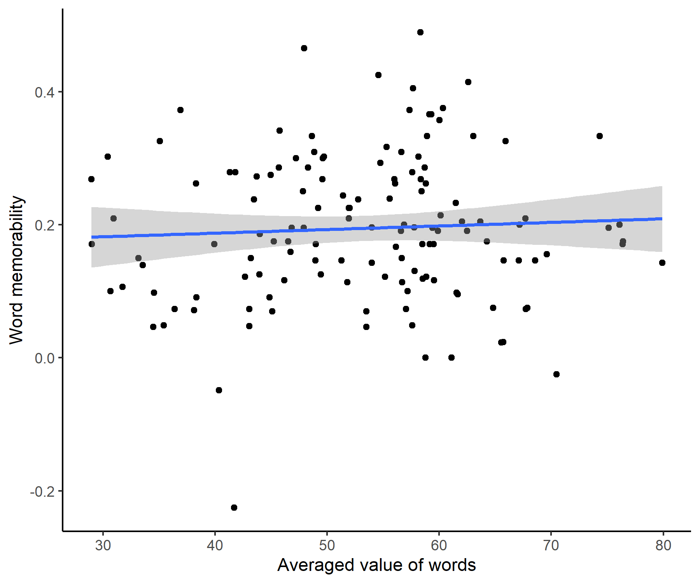

```{r setup, warning = FALSE, message=FALSE, include=FALSE}
knitr::opts_chunk$set(echo = TRUE)

library(tidyverse)
library(dplyr)
library(lme4)
library(readr)
library(tidyr)
library(ggplot2)
library(sjPlot)
library(sjmisc)
library(Hmisc)
#library(plyr)
library(RColorBrewer)
library(reshape2)
library(glmmTMB)

#load raw dataset
dat = read.csv("C:/Users/Christine/Box Sync/data/word_mem/full data/full_word_choice.csv")

#create unique id for each subject
dat$ID = cumsum(!duplicated(dat[c('run_id', 'batch_id')]))

code = dat %>% filter(completioncode !='"')
age = dat %>% filter(ttype =='completion')
rating = dat %>% filter(ttype == 'rating_task')

#select and clean choice trials
choice = dat %>% filter(ttype == 'choice_task')
choice = choice %>% filter(rt != "null") %>% 
  mutate(rt = as.numeric(rt)) %>% 
  mutate(delta.value = as.numeric(value_right) - as.numeric(value_left)) %>% 
  mutate(delta.mem = as.numeric(mem_right) - as.numeric(mem_left)) %>% 
  mutate(choseright = case_when(response == 'k' ~ 1, response =='j' ~ 0)) %>%
  mutate(abs.mem = abs(delta.mem))

#filter out participants who are 2 sd away from the probability of choosing right/left
choice.prob = choice %>% group_by(ID) %>% dplyr::summarize(right.choice = sum(choseright), right.prob = right.choice/138)
mean.p = mean(choice$choseright)
sd.p = sd(choice.prob$right.prob)
choice.ex.prob = choice.prob %>% filter(abs(right.prob-mean.p)<= 2*sd.p)####
choice = filter(choice, (ID %in% choice.ex.prob$ID))

#filter out participants with RT <300 trials
choice.rtfiltered = choice%>% filter(rt>=300)
choice.rtid =  choice.rtfiltered %>%dplyr::group_by(ID) %>% dplyr::summarise(RT = mean(as.numeric(rt)), n = n())
id.filtered = choice.rtid$ID[choice.rtid$n>=69]
choice = filter(choice.rtfiltered, (ID %in% id.filtered))

#mark trials when participants choose more memorable item
choice = choice %>% mutate(chosehigh.mem = case_when(choseright == 1 & delta.mem >=0 ~ 1, choseright == 0 & delta.mem <0 ~ 1, choseright == 1 & delta.mem <0 ~ 0,choseright == 0 & delta.mem >=0 ~ 0 ))
choice = choice %>% dplyr::group_by(ID) %>% dplyr::mutate(z.delta.value = scale(delta.value))

choice.full = choice

###### This chunk can be simplified! ######
#load memorability data
mem = read.csv('C:/Users/Christine/Box Sync/data/word_mem/full data/mem_words.csv')
food = read.csv("C:/Users/Christine/Box Sync/data/mem_dm/stimchar_final_touse.csv")
food.mean = food %>% group_by(stimulus) %>% dplyr::summarize(tasty = mean(rating.tasty),
                                                             pref = mean(choice.rating))
mem = merge(food.mean, mem, by = 'stimulus')


###### This chunk can be simplified! ######

# load rep data
rep = read.csv('C:/Users/Christine/Box Sync/data/word_mem/rep/rep-mean.csv')
mem = merge(rep, mem, by.x = "word", by.y = "food.item")

#calculate mean values for each stimuli
values = rating %>% dplyr::group_by(word) %>% dplyr::summarise(value = mean(as.numeric(response)))
#combine mean values with mem measures
values_mem = merge(values, mem, by.x = 'word', by.y = 'food.item.e', sort = TRUE)

```

## Exclusion Processes

Calculated logistic regressions of `choice ~ delta value` for each participant, exclude those who had negative beta values, and those who had p values < 0.05, since they should make choices in accord with their rated subjective value if they actually paied attention to the task.

Collected 61 participants, 35 left after the exclusion processes

```{r, warning = FALSE, include=FALSE}
# exclude based on beta in logistical regression
choice.beta = data.frame(ID=double(),
                         beta=double(),
                         p=double(),
                         stringsAsFactors=FALSE)[1:length(id.filtered),]
#calculate beta and p for each subject
for (i in 1:length(id.filtered)) {
  d =  choice %>% filter(ID == id.filtered[i], is.na(choseright)==FALSE)
  logistic = glm(choseright ~ 1 + delta.value, data = d, family = "binomial")
  beta = summary(logistic)[['coefficients']][2,1]
  p = summary(logistic)[['coefficients']][2,4]
  choice.beta$ID[i] = id.filtered[i]
  choice.beta$beta[i] = beta
  choice.beta$p[i] = p
}

filtered.b = choice.beta %>% filter(beta>0, p<0.05)

#plot regression lines in z-scored r
g.choice = choice %>% group_by(ID) %>% ggplot(aes(x = z.delta.value, y = choseright, group = ID)) + 
  geom_point() + 
  stat_smooth(method="glm", method.args=list(family="binomial"), se=FALSE)+
  facet_wrap(~ID)
ggsave('choice_by_subject.png', height = 6, width = 7)


#filter choice with beta >0 and p<0.05
choice = filter(choice, (ID %in% filtered.b$ID | ID %in% c(10, 19, 60)))

#plot regression lines after filtering
choice_by_subject_e = choice %>% group_by(ID) %>% ggplot(aes(x = z.delta.value, y = choseright, group = ID)) + 
  geom_point() + 
  stat_smooth(method="glm", method.args=list(family="binomial"), se=FALSE)+
  facet_wrap(~ID)

ggsave('choice_by_subject_e.png', height = 6, width = 7)
knitr::include_graphics("choice_by_subject_e.png")

#write.csv(dat, 'C:/Users/Christine/Box Sync/data/word_mem/full data/cleaned.csv')
#write.csv(rating, 'C:/Users/Christine/Box Sync/data/word_mem/full data/cleaned_rating.csv')
#write.csv(choice, 'C:/Users/Christine/Box Sync/data/word_mem/full data/cleaned_choice.csv')
```


## Distribution plots of delta value and delta memorability

These two plots show the distribution of delta memorability (memorability for more memorable item - less memorable item) and the distribution of delta value (value for more memorable item - value for less memorable item), for all choice pairs among participants.

```{r, warning = FALSE}
#plot abs delta mem
g.deltaMem = choice %>% ggplot(aes(x = abs.mem, fill=..count..))+
  geom_histogram(binwidth = 0.05)+
  theme_classic()+
  xlim(0,1)+
  ggtitle('Distirbution of Delta Memorbaility')+
  xlab('Delta Memorability')

ggsave('g.deltaMem.png', height = 4, width = 6)

```

```{r, warning=FALSE}
#plot delta value where higher mem - lower mem
choice.memvalue =  choice %>%  mutate(value.highmem = case_when(mem_left >= mem_right ~ -delta.value, mem_left < mem_right ~ delta.value))
choice.memvalue =  choice.memvalue %>%  mutate(value.highmem = value.highmem/100)

g.deltaV = choice.memvalue %>% ggplot(aes(x = value.highmem, fill=..count..))+
  geom_histogram(binwidth = 0.02)+
  theme_classic()+
  ggtitle('Distirbution of Delta Value')+
  xlim(-0.5,0.5)+
  xlab('Delta Value')

ggsave('g.deltaV.png', height = 4, width = 6)

```

## Distribution of z-scored ratings by subject

```{r}
#plot the distribution of z-scored values for each subject
rating = rating %>% dplyr::group_by(ID) %>% mutate(z = scale(as.numeric(response)))
#rating %>% dplyr::group_by(ID) %>% ggplot(aes(x = response, group = ID)) + 
#  geom_histogram() + 
#  facet_wrap(~ID)

#plot for z-scored individual ratings
g.rating = rating %>% dplyr::group_by(ID) %>% ggplot(aes(x = z, group = ID)) + 
  geom_histogram() + 
  facet_wrap(~ID) +
  xlim(-3, 3)

ggsave('g.rating.png', height = 7, width = 8)


```


# Model Fitting
### Model for choice behavior
Fitted mixted effects model for delta memorability and delta value, and found no effect of delta word_mem, but strong effect of delta value for predicting the behavior (same as image memorability)

```{r, warning = FALSE}
#mixted effects model for delta mem and delta value
#m1 = glmer(choseright~1+delta.mem*delta.value+(1+delta.mem*delta.value|ID), data = choice, family = "binomial")
#summary(m1)

#plot_model(m1, type = "pred")
```

### Model for RT

RT ~ delta.mem*absolute.delta.value.z with mixed effects
Only z scored delta value able to predict RT, where higher value results in lower RT.

```{r}
## model for RT
choice = choice %>% mutate(abs.delta.v.z = abs(z.delta.value))
m2 = lmer(log(rt)~1+abs(delta.mem)*abs.delta.v.z+(1+abs(delta.mem)*abs.delta.v.z|ID), 
           data = choice)
summary(m2)

#confint(m3,method="Wald")
```

## Explore the averaged subjective value (ratings)

### Correlations between value and memorability for image/words

There's significant correlation between averaged value and image memorability

```{r, warning = FALSE}
# correlation between rated value in word choices and image memorability
cor.test(x = values_mem$value, y = values_mem$Memorability)

# plot the correlation
p.scatter.value.mem = values_mem %>% ggplot(aes(x = value, y = Memorability)) +
  geom_point() +
  geom_smooth(method = 'lm') +
  xlab("Averaged value of words")+
  ylab("Image memorability") +
  theme_classic()

ggsave('p.scatter.value.mem.png', height = 5, width = 6)

```

However, there is no correlation between word memorability and averaged word values

```{r}
# correlation between rated value in word choices and word memorability
cor.test(x = values_mem$value, y = values_mem$word.mem)

# plot the correlation
p.scatter.value.word = values_mem %>% ggplot(aes(x = value, y = word.mem)) +
  geom_point() +
  geom_smooth(method = 'lm') +
  xlab("Averaged value of words")+
  ylab("Word memorability") +
  theme_classic()

ggsave('p.scatter.value.word.png', height = 5, width = 6)

```


### Value and word length

No correlation between values and word length

```{r}
values_mem <- values_mem %>% mutate(length = nchar(word))
# correlation between rated value in word choices and word length
cor.test(x = values_mem$value, y = values_mem$length)

# plot the correlation
p.scatter.value.length = values_mem %>% ggplot(aes(x = value, y = length)) +
  geom_point() +
  geom_smooth(method = 'lm') +
  xlab("Averaged value of words")+
  ylab("Length of words") +
  theme_classic()

ggsave('p.scatter.value.length.png', height = 5, width = 6)

```

## Image mem and word choices

There's a significant positive relation between word choices and image memorability, even after the value of words are controlled.
`How to understand this result?`
```{r}
## Try to calculate image mem and choice behavior
choice.im = merge(choice, mem[c('food.item.e', 'Memorability')], by.x = "stim_left", by.y = "food.item.e") %>% rename(image.m.l = Memorability)
choice.im = merge(choice.im, mem[c('food.item.e', 'Memorability')], by.x = "stim_right", by.y = "food.item.e") %>% rename(image.m.r = Memorability) %>% mutate(delta.im.mem = image.m.r - image.m.l)

#mixted effects model for delta mem and delta value
# m3 = glmer(choseright~1+delta.im.mem*delta.value+(1+delta.im.mem*delta.value|ID), data = choice.im, family = "binomial")
# summary(m3)
# 
# save(m3, file="C:/Users/Christine/Box Sync/data/mem_dm/model/m3_imagemem_wordvalue.RData")

load("C:/Users/Christine/Box Sync/data/mem_dm/model/m3_imagemem_wordvalue.RData")
summary(m3)
plot_model(m3, type = "pred")
```

## Run Regression model with full sample (N = 56)

Run multiple regression model of choice ~ delta_value + delta_mem with the the sample of 56 participants (after filtering them based on RT and left/right bias)

Did not find significant relation between word memorability and choice behavior

```{r}
# run analysis with full sample
# the model with interaction is overfitted, therefore only puts single effects here

# m4 = glmer(choseright~1+delta.mem+delta.value+(1+delta.mem+delta.value|ID), 
#            data = choice.full, 
#            family = "binomial",
#            glmerControl(optimizer = "bobyqa", optCtrl = list(maxfun = 100000)))
# 
# save(m4, file="C:/Users/Christine/Box Sync/data/mem_dm/model/m4_full.RData")

load("C:/Users/Christine/Box Sync/data/mem_dm/model/m4_full.RData")
summary(m4)
plot_model(m4, type = "pred")
```

# Representative Data

## Distribution (N = 40)

```{r}
# Distribution for individuals
rep <- read.csv("C:/Users/Christine/Box Sync/data/word_mem/rep/rep-task.csv")
rep <- rep %>% filter(ttype == "rep_rating")
rep <- rep %>% dplyr::group_by(run_id) %>% dplyr::mutate(z.score = scale(as.numeric(response)))

g.dis = rep %>% dplyr::group_by(run_id) %>% ggplot(aes(x = z.score, group = run_id)) + 
  geom_histogram() + 
  facet_wrap(~run_id) +
  xlim(-3, 3)
g.dis
```

## Averaged data for each image

```{r}
  hist(mem$rep.z, breaks = 20, main = paste("Distribution of Rep data"))

```


## Correlations

```{r}
# possible correlation between representativeness of images and memorability
# found not null correlations
cor.test(mem$rep.z, mem$word.mem)

# no correlation with image memorability
cor.test(mem$rep.z, mem$Memorability)

# positive correlation with tastiness of food images
cor.test(mem$tasty, mem$rep.z)

values_mem %>% ggplot(aes(x = rep.z, y = tasty)) +
  geom_point()+
  geom_smooth(method = 'lm')

# no correlation with averaged word values
cor.test(values_mem$value, values_mem$rep.z)

```

## Try to fit in the model

Add the difference of representativeness into the model of word value and image memorability

p of choosing right ~ delta image memorability * delta word value * delta rep (with random effects)

```{r}
## Merge image rep data to choice task
choice.rep = merge(choice.im, mem[c('food.item.e', 'rep.z')], by.x = "stim_left", by.y = "food.item.e") %>% rename(rep.l = rep.z)
choice.rep = merge(choice.rep, mem[c('food.item.e', 'rep.z')], by.x = "stim_right", by.y = "food.item.e") %>% rename(rep.r = rep.z) %>% mutate(delta.rep = rep.r - rep.l)

# run regression model for image mem, word value, and representativeness of image
# m5 = glmer(choseright~1+delta.im.mem*delta.value*delta.rep+(1+delta.im.mem*delta.value*delta.rep|ID),
#            data = choice.rep, family = "binomial",
#            glmerControl(optimizer = "bobyqa", optCtrl = list(maxfun = 100000)))

load("C:/Users/Christine/Box Sync/data/mem_dm/m5_rep.RData")
summary(m5) 

#save(m5, file="C:/Users/Christine/Box Sync/data/mem_dm/m5_rep.RData")
plot_model(m5, type = "pred")

```

